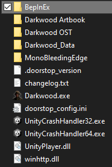

# InventoryResizer

A mod for darkwood that changes your inventory size to whatever you want
You can find versions of the dll in every commit change and download it

Notice: You can change any setting in-game and it will take effect no reloading needed!

## WARNING

This mod by default will remove excess slots!\
What this means: If you had a larger inventory/storage than what you set in this mod the extra inventory slots will be removed unless you disable the config option!

## INVENTORY WARNING

If you do enable this, the changes are permanent! You can change it back by remembering at what inventory upgrade you are at but that's only if you remember\
Other way to change it back is to practically guess or if you're on max upgrade then it's 9 down slots (2x9)

Upgrade 0 is 6 slots down (no upgrades)\
Upgrade 1 is 7\
Upgrade 2 is 8\
Upgrade 3 is 9

Another warning is because to me my modification for this looks very sketchy do make issues if you find it modifying something other than the player inventory, do not let this persuade you though, there is nothing to lose and it'll just look funny and make some work for me.

## Installation

This mod uses BepInEx for it's loader, you can download BepInEx [here](https://github.com/BepInEx/BepInEx/releases)\
The mod was made on [BepInEx version 5.4.23.2](https://github.com/BepInEx/BepInEx/releases/tag/v5.4.23.2)\
Download BepInEx and unzip it into your game folder and then put this mod (InventoryResizer.dll) into BepInEx/plugins/\
The directory should look like this:\

It doesn't matter how you install the mod into the plugin folder just so long as it's there BepInEx will look for DLLs in that folder

- BepInEx
  - plugins
    - InventoryResizer.dll

## Configuration

You can change configurations of the mod inside Bepinex/Config and opening the .cfg with a text editor, yes, you can use notepad.\
Notice: You can change any setting in-game and it will take effect no reloading needed!
